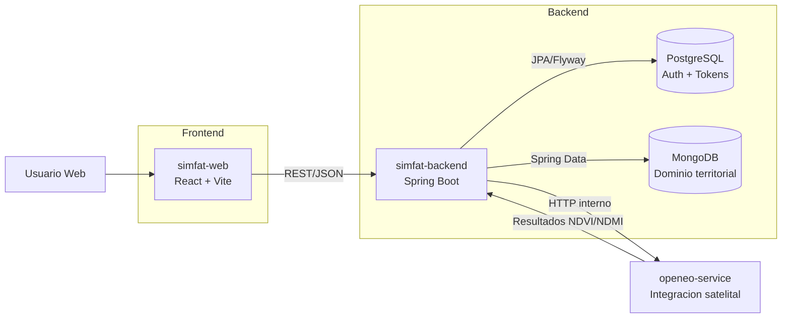

# Arquitectura Actualizada - SIMFAT

- Fecha: 2026-04-21
- Version: 1.0
- Alcance: estado actualizado para iteracion territorial/comunitaria.

## Vista de alto nivel

## Decisiones de arquitectura

- Frontend mantiene arquitectura modular y consume backend real.
- Backend separa persistencia por responsabilidad:
  - PostgreSQL: autenticacion, sesiones y seguridad.
  - MongoDB: datos territoriales, alertas, snapshots y trazabilidad openEO.
- `openeo-service` queda desacoplado como integracion especializada, evitando sobrecargar el frontend.
- Flyway controla cambios relacionales y habilita trazabilidad de esquema.

## Riesgos y mitigaciones

- Dependencia de `openeo-service` para indicadores avanzados.
  - Mitigacion: fallback con snapshots/documentos historicos en MongoDB.
- Costo por llamadas externas.
  - Mitigacion: cache/TTL por region y actualizacion programada en backend.
- Datos heterogeneos por fuente territorial.
  - Mitigacion: contratos backend con validacion y normalizacion centralizada.
