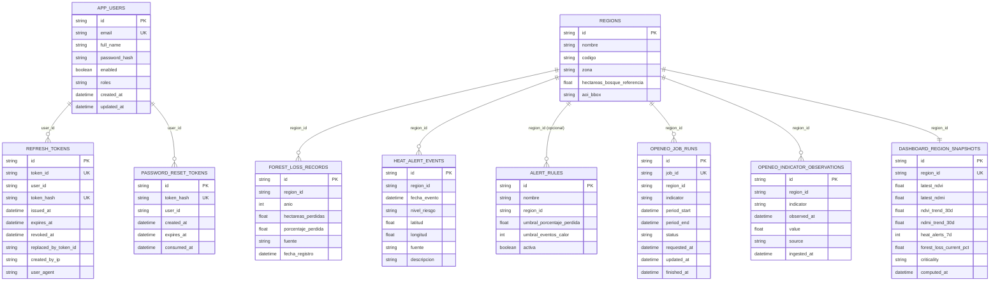

# MER Actualizado - SIMFAT Backend

- Fecha: 2026-04-21
- Version: 1.0
- Nota: modelo hibrido (relacional + documental).

## MER (vista logica)

## Observaciones

- Las relaciones con `region_id` y `user_id` son controladas por aplicacion.
- SQL se versiona con Flyway (`V1__create_auth_tables.sql`).
- Mongo prioriza indices en flujos operacionales (`openeo_*`, snapshots).
